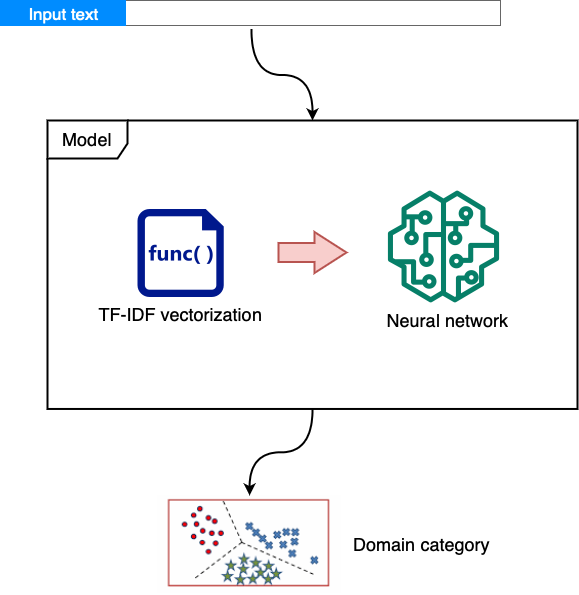

Scientific documents classification (ETDs & articles) using multilayer perceptron - languages including english, french, arabic

# Classification system
['Health sciences', 'Fundamental sciences', 'Engineering', 'Applied sciences', 'Social sciences', 'Languages and literature, Archaeology', 'Law', 'Administrative sciences', 'Arts', 'Multidisciplinary']

# Model architecture

# Code
import joblib
#
model = joblib.load("model.pkl") # load 
#
label = model.predict([text]) # predict 
